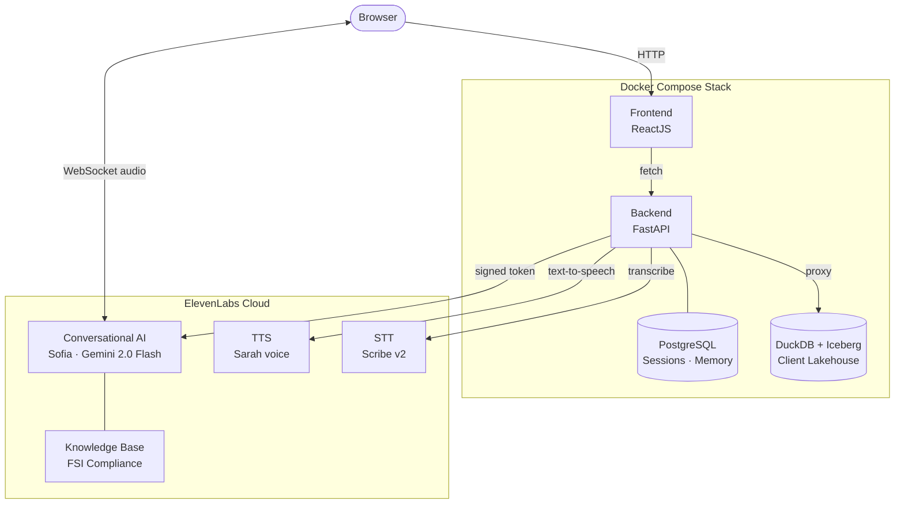
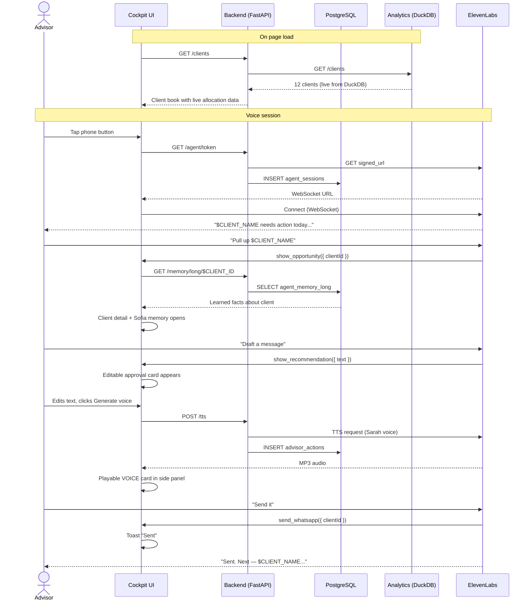

# Wealth Advisor Hub

A wealth advisor manages 45 clients. Each one expects to feel like the only client. Most don't.

The gap between that expectation and reality is where relationships break, churn happens, and regulatory issues appear. sofIA closes that gap: a voice-first AI advisor built on ElevenLabs that runs inside the advisor's cockpit, monitors the entire book in real time, and executes — navigate, draft, generate, send — through natural conversation.

---

## The Problem

Wealth advisors in private banking and wealth management face a structural tension: their value is personal relationships, but the economics of their book force them to spread attention across 40 to 60 clients simultaneously.

A volatile market opens in the morning. Twelve clients need to hear something specific. Four have suitability assessments expiring this week. Two are at churn risk because no one called last quarter. The advisor has one morning and a phone.

The tools don't help. CRMs are reactive — they answer queries, they don't surface what matters. Portfolio platforms show data but don't tell the advisor what to do with it. Compliance documentation absorbs time that should go to clients. And the cost of the wrong message — generic, mis-timed, off-profile — is a relationship that quietly leaves.

**sofIA flips the model.** Instead of the advisor querying tools, the AI proactively surfaces who needs action today, drafts the right message for that specific client at that risk profile, generates it in a natural voice, and gets it out — with the advisor directing everything through voice and approving before anything sends. Hyper-personalization at the scale of a full book, without the overhead.

---

## The Cockpit

sofIA is the AI layer inside the advisor's workspace. The advisor opens the cockpit and Sofia is already there — she's read the book, flagged the priorities, and is ready to act.

The differentiator is the interaction model: **the cockpit is operated by voice**. The advisor doesn't click through menus or type into forms. They talk. "Pull up Ricardo." "Draft a message." "Send it." Sofia navigates the dashboard, opens client profiles, writes recommendations, generates audio previews, and confirms sends — all mid-conversation, without breaking flow.

This matters beyond convenience. In a live demo with bank executives across the table, voice control demonstrates something a click-based tool never could: that the AI understands intent, acts on it in real time, and keeps the human in control without slowing them down.

---

## Architecture



**Stack:** React · FastAPI · PostgreSQL · DuckDB + Iceberg · ElevenLabs (Conversational AI, TTS Scribe v2 STT)

| Container | Purpose |
|---|---|
| `front` | Cockpit UI served via nginx |
| `backend` | API gateway — ElevenLabs proxy + postgres integration |
| `postgres` | Agent sessions, memory, advisor action log |
| `analytics` | DuckDB lakehouse — client book, recommendations, alerts |

---

## What Sofia Can Do

| Action | How |
|---|---|
| Navigate the cockpit | `navigate({route})` updates the dashboard view |
| Open a client panel | `show_opportunity({clientId})` routes to client detail |
| Draft a recommendation | `show_recommendation({text})` opens an editable approval card |
| Generate a voice preview | `generate_voice_message({text})` calls `/tts`, saves playable card |
| Send via WhatsApp | `send_whatsapp({clientId})` confirms delivery |
| Read live data | `get_client_data({clientId})` reads cockpit state silently |
| Suggest next priority | Built into system prompt, fires after every send |

---

## Sofia in Action



---

## Setup

### Prerequisites

- Git
- Docker + Docker Compose
- ElevenLabs account (free tier works for a demo)

### 1. Clone

```bash
git clone https://github.com/thoravieira/wealth-advisor-hub.git
cd wealth-advisor-hub
```

### 2. Configure environment

```bash
cp .env.example .env
# Edit .env and add your ELEVENLABS_API_KEY
```

### 3. Create the ElevenLabs agent (run once)

This creates the Sofia agent, uploads the FSI knowledge base, and writes the IDs back to `.env`:

```bash
ELEVENLABS_API_KEY=sk_... python setup/create_agent.py
```

### 4. Start the full stack

```bash
docker compose up --build
```

All four containers start in dependency order: postgres and analytics first, then backend, then front.

| Service | URL |
|---|---|
| Cockpit | http://localhost:8080/cockpit.html |
| Backend health | http://localhost:8000/health |
| Analytics health | http://localhost:8001/health |

When all four containers show `healthy`, open the cockpit and tap the equalizer button in the bottom-right to start a session with Sofia.

---

## Project Structure

```
.
├── front/
│   ├── cockpit.html           # single-file cockpit (dc template engine)
│   ├── support.js             # dc runtime
│   ├── index.html             # redirect to cockpit.html
│   └── Dockerfile             # nginx
│
├── backend/
│   ├── main.py                # FastAPI: ElevenLabs proxy + postgres integration
│   ├── requirements.txt
│   └── Dockerfile
│
├── analytics/
│   ├── main.py                # DuckDB FastAPI: clients, recommendations, alerts
│   ├── seed.py                # 12 demo clients
│   ├── requirements.txt
│   └── Dockerfile
│
├── db/
│   └── init.sql               # PostgreSQL schema (sessions, memory, actions)
│
├── setup/
│   ├── create_agent.py        # idempotent ElevenLabs agent + KB setup
│   └── compliance_guide.txt   # FSI knowledge base content
│
├── tests/
│   ├── conftest.py
│   ├── test_01_backend_current.py    # 21 tests: health, TTS, STT, agent token
│   ├── test_02_frontend_current.py   # 11 tests: pages load, old filenames gone
│   ├── test_03_postgres.py           #  6 tests: schema, memory API
│   ├── test_04_analytics.py          # 32 tests: clients, recommendations, alerts
│   └── test_05_backend_pg_integration.py  # 13 tests: postgres integration, proxies
│
├── docs/
│   ├── ARCHITECTURE.md
│   ├── flows/
│   │   ├── SOFIA_FLOW.md
│   │   └── COCKPIT_FLOWS.md
│   └── specs/
│       └── SPEC-007-cockpit-v2.md
│
├── .env.example
├── docker-compose.yml
└── README.md
```

---

## Backend API

| Method | Endpoint | Description |
|---|---|---|
| `GET` | `/health` | `{status, agent_id, postgres, analytics}` |
| `GET` | `/agent/token` | ElevenLabs signed WebSocket URL; writes session to postgres |
| `POST` | `/tts` | `{text, voice_id?, client_id?}` → `audio/mpeg`; logs action |
| `POST` | `/stt` | audio file → `{transcript, words}` via Scribe v2 |
| `GET` | `/memory/long/{client_id}` | Facts Sofia learned about a client |
| `POST` | `/memory/long` | Save a fact to long-term memory |
| `GET` | `/actions` | Advisor action audit log |
| `GET` | `/clients[/{id}]` | Proxy to analytics service |

## Analytics API

| Method | Endpoint | Description |
|---|---|---|
| `GET` | `/clients` | All 12 demo clients |
| `GET` | `/clients/{id}` | Single client profile |
| `GET` | `/clients/{id}/snapshots` | Portfolio time series |
| `GET/POST` | `/recommendations` | Recommendation lifecycle |
| `PATCH` | `/recommendations/{id}` | Update status (approved/sent) |
| `GET/POST` | `/voice-messages` | TTS message history |
| `GET` | `/alerts` | Risk and compliance alerts |

---

## ElevenLabs Agent

| | |
|---|---|
| Voice | Sarah (`EXAVITQu4vr4xnSDxMaL`) |
| LLM | Gemini 2.0 Flash |
| STT | Scribe v2 |
| Knowledge Base | FSI Advisory Compliance Guide v2.1 |
| Client tools | navigate, show_opportunity, show_recommendation, generate_voice_message, send_whatsapp, get_client_data |

---

## Roadmap

#### v2 — Voice Intelligence

- [ ] **Real-time call intelligence** `ElevenLabs STT` — Sofia joins the advisor-client call as a silent observer. She surfaces the client's portfolio in real time, flags live suitability constraints, and suggests the next talking point — without interrupting the conversation.
- [ ] **Advisor voice clone** `ElevenLabs Voice Clone` — Generate outreach messages in the advisor's own voice. The client hears their advisor, not a generic TTS. Personalization at book scale without the advisor recording 40 individual messages.

#### v3 — Proactive Outreach

- [ ] **Outbound AI calls** `ElevenLabs Outbound Calling` — When a market event triggers a priority alert, Sofia calls the client automatically. The advisor reviews a call summary and approves follow-up actions after the fact.
- [ ] **Sentiment-aware follow-up** `ElevenLabs STT` — Detect the client's emotional tone from voice and adjust message style accordingly. An anxious client gets reassurance; an engaged one gets a timely opportunity pitch.

#### v4 — Scale and Polish

- [ ] **Multilingual book support** — Sofia auto-detects the client's preferred language from the first sentence and switches mid-conversation. A Portuguese-speaking advisor with English-dominant clients handles both without configuration.
- [ ] **Sound design for client calls** `ElevenLabs Sound Effects` — Professional ambient audio layered into client-facing calls. Small detail, large impression in high-value relationships.

---

## Docs

- [Architecture](docs/ARCHITECTURE.md)
- [Sofia interaction flow](docs/flows/SOFIA_FLOW.md)
- [Cockpit navigation flows](docs/flows/COCKPIT_FLOWS.md)
- [Design spec (SPEC-007)](docs/specs/SPEC-007-cockpit-v2.md)

---

## License

MIT — free to use, modify, and distribute for any purpose including commercial.
See [LICENSE](LICENSE) for full terms.
