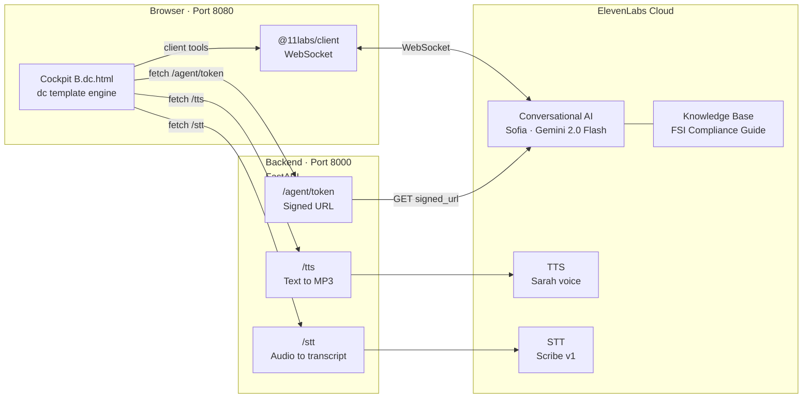
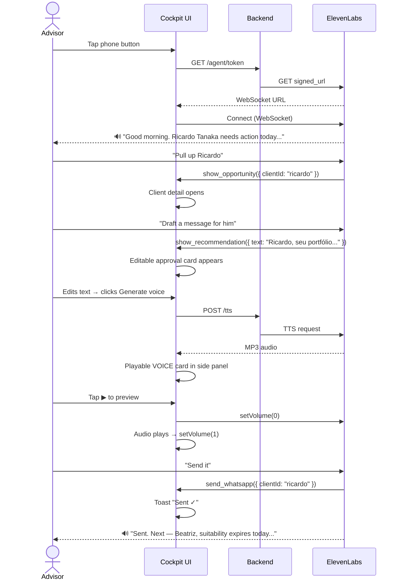

# Wealth Advisor Hub

Real-time voice cockpit for wealth advisors. Sofia, an AI advisor built on ElevenLabs Conversational AI, joins the session and can navigate the dashboard, pull up client profiles, draft and generate voice messages, and suggest next actions — all mid-conversation, through natural voice.

---

## Architecture



**Stack:** Static HTML + vanilla JS · FastAPI · ElevenLabs (Conversational AI, TTS, STT) · Docker + nginx

---

## What Sofia Can Do

| Action | Implementation |
|---|---|
| Navigate the cockpit | `navigate({route})` updates the dashboard view |
| Open a client panel | `show_opportunity({clientId})` routes to client detail |
| Show a recommendation | `show_recommendation({text})` opens an editable approval card |
| Generate a voice preview | `generate_voice_message({text})` calls `/tts`, saves playable card |
| Send via WhatsApp | `send_whatsapp({clientId})` confirms delivery (mock) |
| Look up client data | `get_client_data({clientId})` reads live cockpit state |
| Suggest next action | Built into system prompt, fires after every send |



---

## Setup

### Prerequisites

- Docker + Docker Compose
- ElevenLabs account (free tier works)
- Agent created via `setup/create_agent.py`

### 1. Configure environment

```bash
cp .env.example .env
# add your ELEVENLABS_API_KEY
```

### 2. Create the ElevenLabs agent (run once)

```bash
ELEVENLABS_API_KEY=sk_... python setup/create_agent.py
# writes AGENT_ID, KB_ID, VOICE_ID to .env
```

### 3. Start

```bash
docker compose up --build
```

| Service | URL |
|---|---|
| Cockpit | http://localhost:8080/cockpit.html |
| Backend | http://localhost:8000 |
| Health | http://localhost:8000/health |

---

## Running without Docker

```bash
# Backend
cd backend
pip install -r requirements.txt
source ../.env && uvicorn main:app --reload --port 8000

# Frontend (separate terminal)
cd front
docker build -t wealth-advisor-hub . && docker run -p 8080:80 wealth-advisor-hub
```

---

## Project Structure

```
.
├── front/
│   ├── Cockpit B.dc.html      # single-file cockpit (dc template engine)
│   ├── support.js             # dc runtime
│   ├── index.html             # redirect
│   └── Dockerfile             # nginx
│
├── backend/
│   ├── main.py                # FastAPI: /tts, /stt, /agent/token, /health
│   ├── requirements.txt
│   └── Dockerfile
│
├── setup/
│   ├── create_agent.py        # creates the ElevenLabs agent + knowledge base
│   └── compliance_guide.txt   # FSI compliance knowledge base
│
├── docs/
│   ├── ARCHITECTURE.md
│   ├── flows/
│   │   ├── SOFIA_FLOW.md
│   │   └── COCKPIT_FLOWS.md
│   └── specs/
│       ├── SPEC-001-advisor-agent.md
│       ├── SPEC-006-elevenlabs-agent.md
│       └── SPEC-007-cockpit-v2.md
│
├── .env.example
├── docker-compose.yml
└── README.md
```

---

## Backend API

| Method | Endpoint | Description |
|---|---|---|
| `GET` | `/health` | `{status, agent_id}` |
| `GET` | `/agent/token` | ElevenLabs signed WebSocket URL |
| `POST` | `/tts` | `{text, voice_id?}` → `audio/mpeg` |
| `POST` | `/stt` | audio file → `{transcript, words}` |

---

## ElevenLabs Agent

| | |
|---|---|
| Agent ID | `agent_7501kwap3zrre9wr5h20vdqbtz7n` |
| Voice | Sarah (`EXAVITQu4vr4xnSDxMaL`) |
| LLM | Gemini 2.0 Flash |
| Knowledge Base | FSI Advisory Compliance Guide v2.1 |
| Client tools | navigate, show_opportunity, show_recommendation, generate_voice_message, send_whatsapp, get_client_data |

---

## Docs

- [Architecture](docs/ARCHITECTURE.md)
- [Sofia interaction flow](docs/flows/SOFIA_FLOW.md)
- [Cockpit navigation flows](docs/flows/COCKPIT_FLOWS.md)
- [Design spec (SPEC-007)](docs/specs/SPEC-007-cockpit-v2.md)
