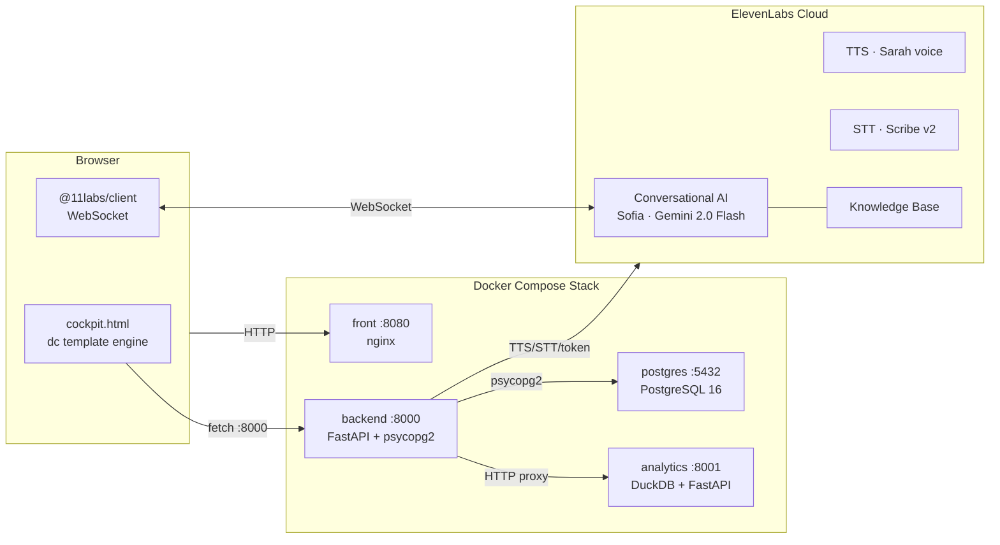
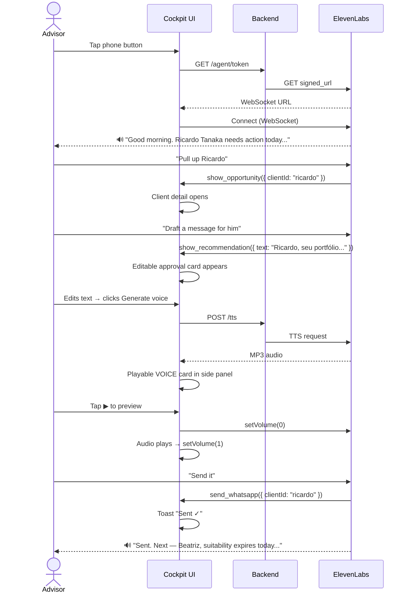

# Wealth Advisor Hub

Real-time voice cockpit for wealth advisors. Sofia, an AI advisor built on ElevenLabs Conversational AI, joins the session and can navigate the dashboard, pull up client profiles, draft and generate voice messages, and suggest next actions — all mid-conversation, through natural voice.

---

## Architecture



**Stack:** nginx · FastAPI · PostgreSQL 16 · DuckDB · ElevenLabs (Conversational AI, TTS, STT)

| Container | Port | Purpose |
|---|---|---|
| `front` | 8080 | Static HTML cockpit via nginx |
| `backend` | 8000 | API gateway — ElevenLabs proxy + postgres integration |
| `postgres` | 5432 | Agent sessions, memory, advisor action log |
| `analytics` | 8001 | DuckDB lakehouse — client book, recommendations, alerts |

---

## What Sofia Can Do

| Action | Implementation |
|---|---|
| Navigate the cockpit | `navigate({route})` updates the dashboard view |
| Open a client panel | `show_opportunity({clientId})` routes to client detail |
| Show a recommendation | `show_recommendation({text})` opens an editable approval card |
| Generate a voice preview | `generate_voice_message({text})` calls `/tts`, saves playable card |
| Send via WhatsApp | `send_whatsapp({clientId})` confirms delivery (mock) |
| Look up client data | `get_client_data({clientId})` reads live cockpit state |
| Suggest next action | Built into system prompt, fires after every send |



---

## Setup

### Prerequisites

- Docker + Docker Compose
- ElevenLabs account (free tier works)
- Agent created via `setup/create_agent.py`

### 1. Configure environment

```bash
cp .env.example .env
# add your ELEVENLABS_API_KEY
```

### 2. Create the ElevenLabs agent (run once)

```bash
ELEVENLABS_API_KEY=sk_... python setup/create_agent.py
# writes AGENT_ID, KB_ID, VOICE_ID to .env
```

### 3. Start

```bash
docker compose up --build
```

| Service | URL |
|---|---|
| Cockpit | http://localhost:8080/cockpit.html |
| Backend | http://localhost:8000/health |
| Analytics | http://localhost:8001/health |

---

## Project Structure

```
.
├── front/
│   ├── cockpit.html           # single-file cockpit (dc template engine)
│   ├── support.js             # dc runtime
│   ├── index.html             # redirect to cockpit.html
│   └── Dockerfile             # nginx
│
├── backend/
│   ├── main.py                # FastAPI: ElevenLabs proxy + postgres integration
│   ├── requirements.txt
│   └── Dockerfile
│
├── analytics/
│   ├── main.py                # DuckDB FastAPI: clients, recommendations, alerts
│   ├── seed.py                # 12 demo clients
│   ├── requirements.txt
│   └── Dockerfile
│
├── db/
│   └── init.sql               # PostgreSQL schema (sessions, memory, actions)
│
├── setup/
│   ├── create_agent.py        # idempotent ElevenLabs agent + KB setup
│   └── compliance_guide.txt   # FSI knowledge base content
│
├── tests/
│   ├── conftest.py
│   ├── test_01_backend_current.py    # 21 tests: health, TTS, STT, agent token
│   ├── test_02_frontend_current.py   # 11 tests: pages load, old filenames gone
│   ├── test_03_postgres.py           #  6 tests: schema, memory API
│   ├── test_04_analytics.py          # 32 tests: clients, recommendations, alerts
│   └── test_05_backend_pg_integration.py  # 13 tests: postgres integration, proxies
│
├── docs/
│   ├── ARCHITECTURE.md
│   ├── flows/
│   │   ├── SOFIA_FLOW.md
│   │   └── COCKPIT_FLOWS.md
│   └── specs/
│       └── SPEC-007-cockpit-v2.md
│
├── .env.example
├── docker-compose.yml
└── README.md
```

---

## Backend API

| Method | Endpoint | Description |
|---|---|---|
| `GET` | `/health` | `{status, agent_id, postgres, analytics}` |
| `GET` | `/agent/token` | ElevenLabs signed WebSocket URL; writes session to postgres |
| `POST` | `/tts` | `{text, voice_id?, client_id?}` → `audio/mpeg`; logs action |
| `POST` | `/stt` | audio file → `{transcript, words}` via Scribe v2 |
| `GET` | `/memory/long/{client_id}` | Facts Sofia learned about a client |
| `POST` | `/memory/long` | Save a fact to long-term memory |
| `GET` | `/actions` | Advisor action audit log |
| `GET` | `/clients[/{id}]` | Proxy to analytics service |

## Analytics API

| Method | Endpoint | Description |
|---|---|---|
| `GET` | `/clients` | All 12 demo clients |
| `GET` | `/clients/{id}` | Single client profile |
| `GET` | `/clients/{id}/snapshots` | Portfolio time series |
| `GET/POST` | `/recommendations` | Recommendation lifecycle |
| `PATCH` | `/recommendations/{id}` | Update status (approved/sent) |
| `GET/POST` | `/voice-messages` | TTS message history |
| `GET` | `/alerts` | Risk and compliance alerts |

---

## ElevenLabs Agent

| | |
|---|---|
| Agent ID | `agent_7501kwap3zrre9wr5h20vdqbtz7n` |
| Voice | Sarah (`EXAVITQu4vr4xnSDxMaL`) |
| LLM | Gemini 2.0 Flash |
| STT | Scribe v2 |
| Knowledge Base | FSI Advisory Compliance Guide v2.1 |
| Client tools | navigate, show_opportunity, show_recommendation, generate_voice_message, send_whatsapp, get_client_data |

---

## Docs

- [Architecture](docs/ARCHITECTURE.md)
- [Sofia interaction flow](docs/flows/SOFIA_FLOW.md)
- [Cockpit navigation flows](docs/flows/COCKPIT_FLOWS.md)
- [Design spec (SPEC-007)](docs/specs/SPEC-007-cockpit-v2.md)
