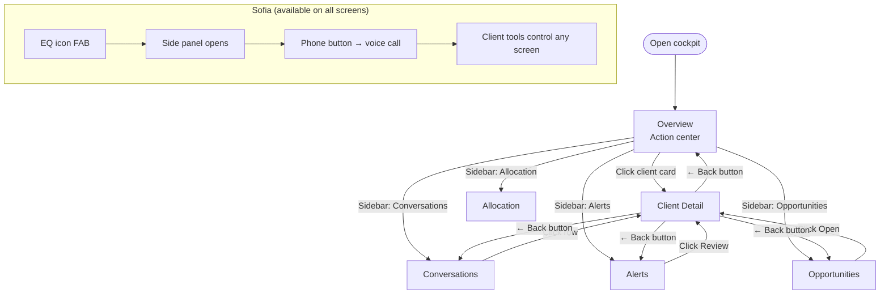
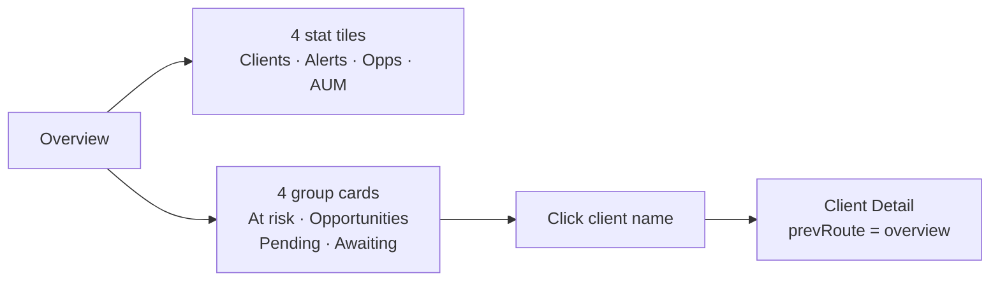
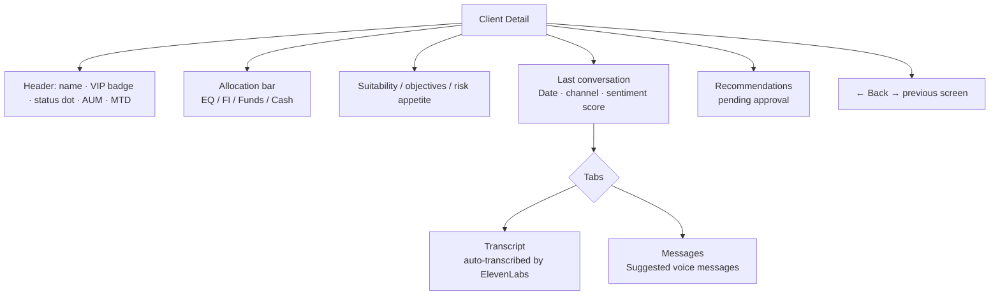
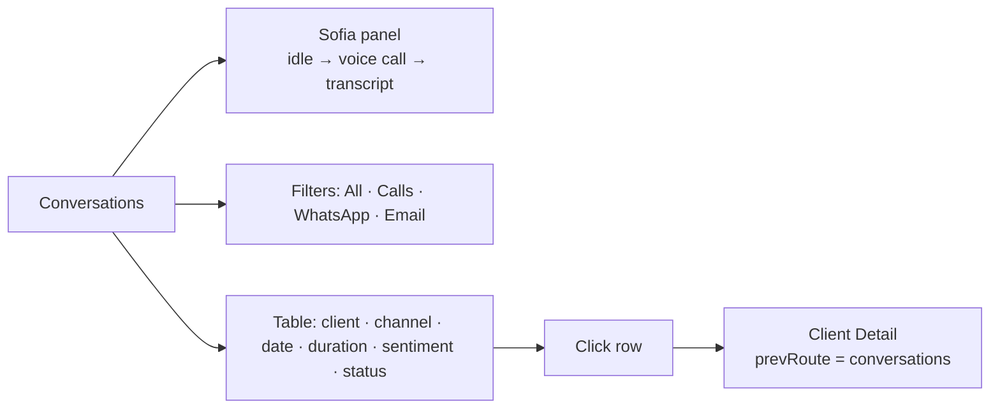
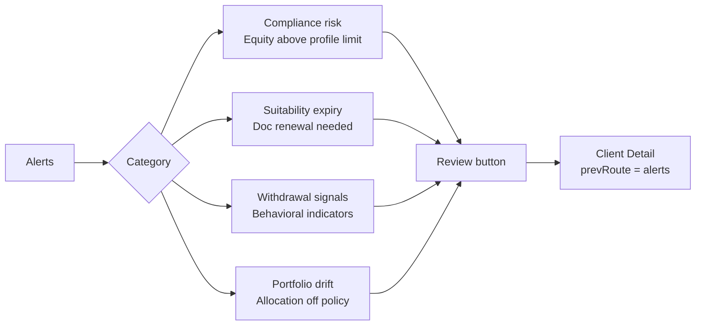
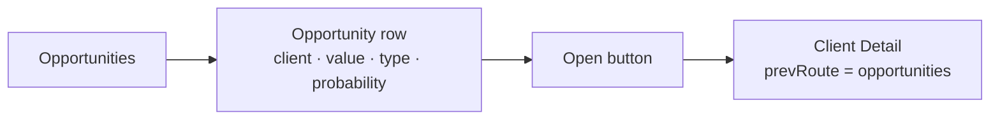
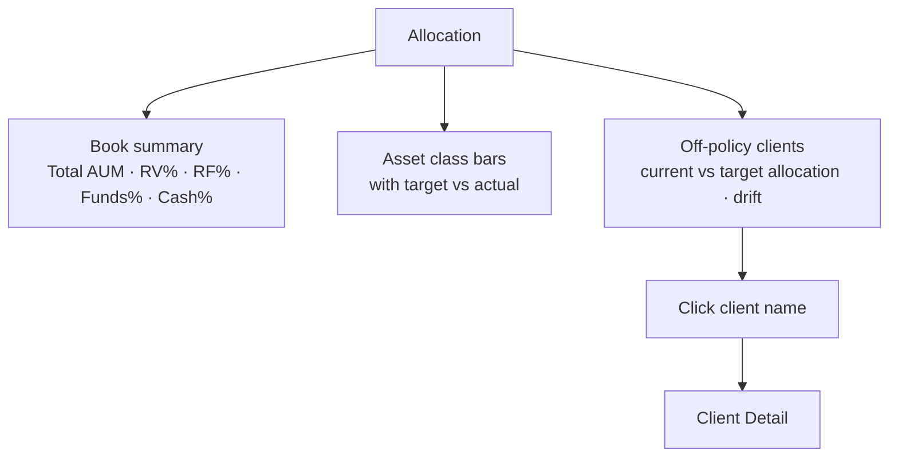
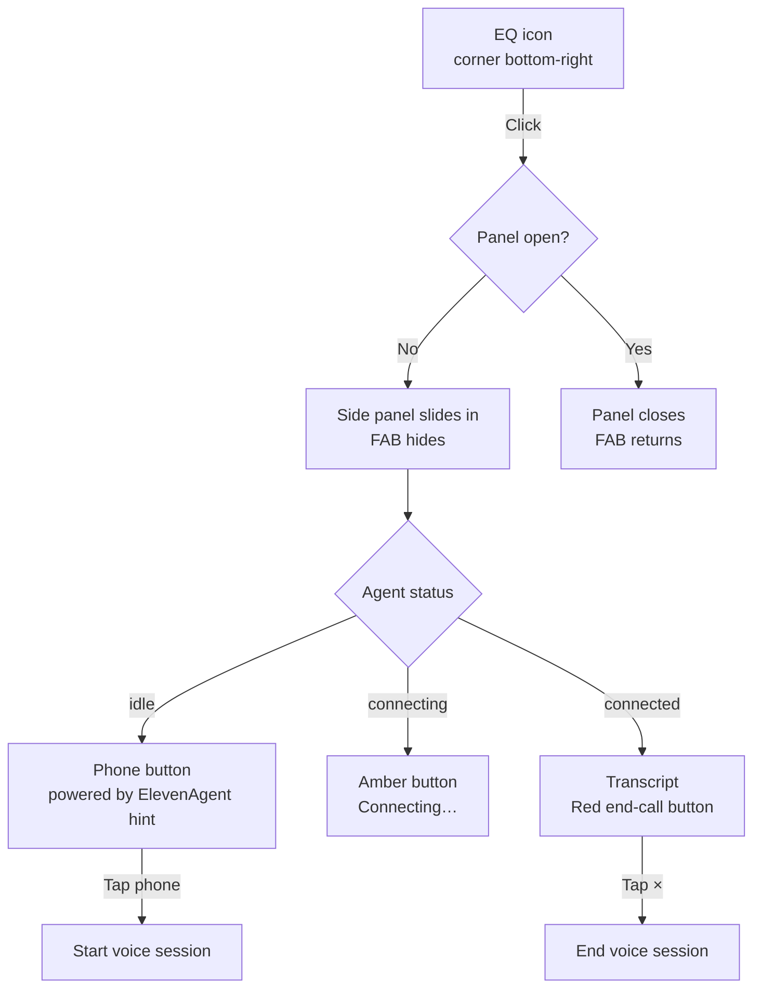

# Flow — Cockpit UI Navigation & Features

Overview of all screens, how to reach them, and what actions are available on each.

---

## Navigation Map

---

## Screen: Overview

**Purpose:** At-a-glance action center — what needs the advisor now.

**Stat tiles:**
| Tile | Description |
|---|---|
| Clients | Total book size (45) |
| Alerts | Active compliance/risk flags |
| Opportunities | Open revenue moments |
| AUM | Total assets under management |

**Group cards:**
| Group | Clients shown |
|---|---|
| At risk | Withdrawal intent, concentration above limit |
| Opportunities | Expected inflows, life events |
| Pending | Approvals, suitability renewals needed |
| Awaiting | Proposals sent, no client response |

---

## Screen: Client Detail

**Purpose:** Full profile of one client — allocation, last conversation, transcript, compliance flags, recommendations.

**Back button** routes to `prevRoute` — the screen that opened this client (overview, conversations, alerts, opportunities). Set at click time so the return is always correct.

---

## Screen: Conversations

**Purpose:** Full log of recorded client interactions, transcribed by ElevenLabs.

**Sofia panel** (top of this screen):
- Idle: status dot + hint text + phone button
- Active: live transcript + red end-call button

---

## Screen: Alerts

**Purpose:** Risk, compliance, and behavioral signals across the full book.

---

## Screen: Opportunities

**Purpose:** Revenue moments — inflows, life events, engagement triggers.

**Opportunity types:** Expected inflow · Portfolio rebalance · Product migration · Life event (birthday, retirement) · Suitability renewal

---

## Screen: Allocation

**Purpose:** Book-level allocation overview and off-policy positions.

---

## FAB → Sofia Panel Flow

The floating action button (EQ bars animation) is always visible, on every screen.

---

## Language Toggle

All UI strings exist in English and Portuguese. Toggle in the sidebar header switches instantly — no reload, no API call. Sofia's conversation remains in English (agent language setting).

---

## Feature Matrix by Screen

| Feature | Overview | Conversations | Client Detail | Alerts | Opportunities | Allocation |
|---|---|---|---|---|---|---|
| Sofia voice call | ✓ | ✓ (primary) | ✓ | ✓ | ✓ | ✓ |
| Navigate here via Sofia | ✓ | ✓ | ✓ | ✓ | ✓ | ✓ |
| Client list | ✓ (grouped) | ✓ (table) | — | ✓ | ✓ | ✓ |
| Open client detail | ✓ | ✓ | — | ✓ | ✓ | ✓ |
| Approval card overlay | ✓ | ✓ | ✓ | ✓ | ✓ | ✓ |
| Voice preview player | ✓ | ✓ | ✓ | ✓ | ✓ | ✓ |
| Language toggle | ✓ | ✓ | ✓ | ✓ | ✓ | ✓ |
