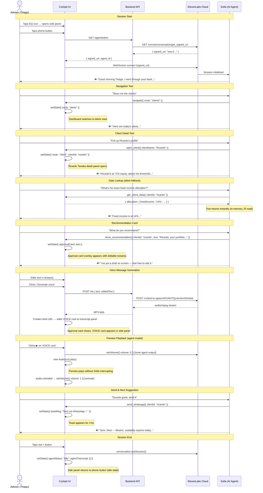
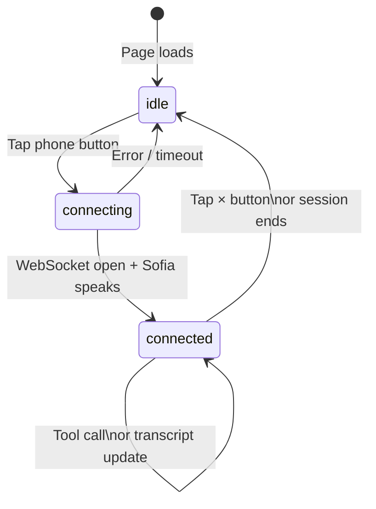

# Flow — Sofia Voice Interaction

The core feature of the cockpit: the advisor has a real-time voice conversation with Sofia, who can read client data, navigate the dashboard, and draft messages for approval — all mid-conversation.

---

## Sequence Diagram

---

## State Machine — Agent Status

---

## Client Tool Registry

| Tool | Trigger | UI effect | Returns |
|---|---|---|---|
| `navigate` | "Go to X" | Route changes — overview, clients, alerts, opportunities, allocation | `"navigated to X"` |
| `open_client` | "Pull up [client]" | Client detail panel opens (by name or ID) | `"opened client X"` |
| `open_client_tab` | "Switch to recommendations" | Left panel tab switches — overview or recommendations | `"switched to tab X"` |
| `open_conversation_tab` | "Show transcript" | Right panel tab switches — transcript, summary, messages | `"switched tab to X"` |
| `list_clients` | "Who are your clients?" | Silent read | JSON array of {id, name, aum} |
| `get_client_data` | Any specific data question | Reads `_clientsById` JS map silently | JSON client object |
| `show_opportunity` | Legacy alias for open_client | Client detail panel opens | `"opened client X"` |
| `show_recommendation` | Sofia drafts a message | Approval card with editable textarea | `"recommendation shown"` |
| `edit_recommendation` | "Edit the message" | Approval card opens with current text for editing | `"editing recommendation"` |
| `generate_voice_message` | Agent-initiated TTS | Calls `/tts`, saves playable VOICE card | `"voice message generated"` |
| `send_whatsapp` | After advisor approves | Toast "Sent via WhatsApp ✓", clears card | `"sent via whatsapp"` |

---

## Voice Preview UX Detail

```mermaid
flowchart LR
    A[Approval card\nappears] --> B[Advisor edits\ntextarea]
    B --> C[Click Generate voice]
    C --> D[POST /tts]
    D --> E[Blob URL created]
    E --> F[VOICE card\nin side panel]
    F --> G{Tap ▶}
    G --> H[Agent output muted]
    H --> I[Audio plays]
    I --> J[Audio ends]
    J --> K[Agent output restored]
    K --> L[Advisor responds\nto Sofia]
    L --> M{Approved?}
    M -->|Yes| N[say send it]
    M -->|No| O[say edit or regenerate]
    N --> P[send_whatsapp tool]
    P --> Q[Toast ✓ + next suggestion]
```

